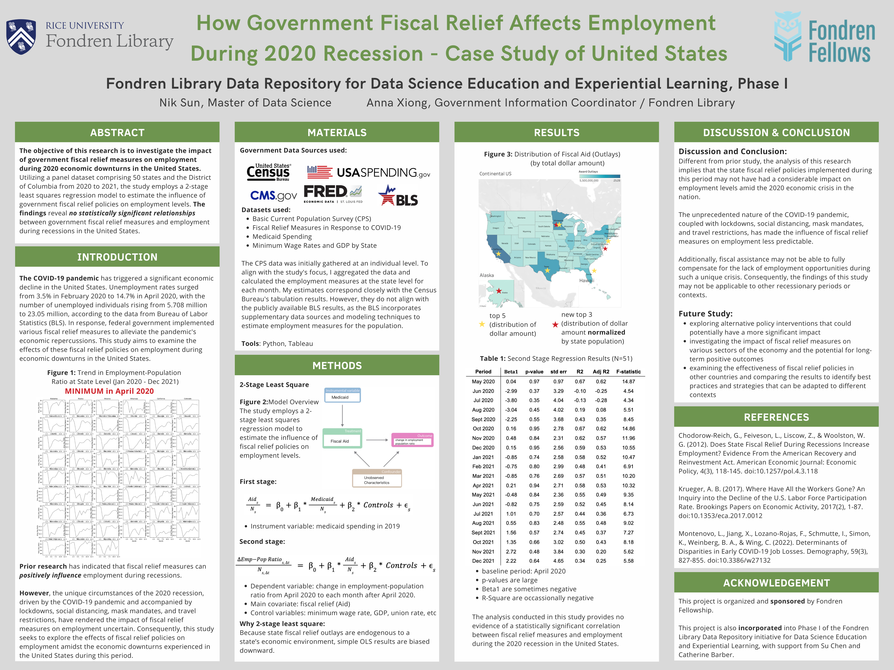

# How Government Fiscal Relief Affected Employment in the United States During the 2020 Recession

The objective of this research is to investigate the impact of government fiscal relief measures on employment during 2020 economic downturns 
in the United States. Utilizing a panel dataset comprising 50 states and the Districtof Columbia from 2020 to 2021, 
the study employs a 2-stage least square regression model to estimate the influence ofgovernment fiscal relief policies on employment levels. 
The findings reveal no statistically significant relationshipsbetween government fiscal relief measures and employmentduring recessions in the United States.

In broader context, this project is a pilot collaborative effort between Fondren Library, data science faculty, and students at Rice University, 
a project initiated by one of the co-authors of this presentation Ms Anna Xiong. It emphasizes the significance of data science education and 
the challenges in incorporating real-world datasets into curricula. The project showcases the value of open government data and collaborative 
efforts in promoting and facilitating the effective use of government economic data and beyond, as well as developing curated student 
friendly open government datasets that support data science learning, research, and teaching.

